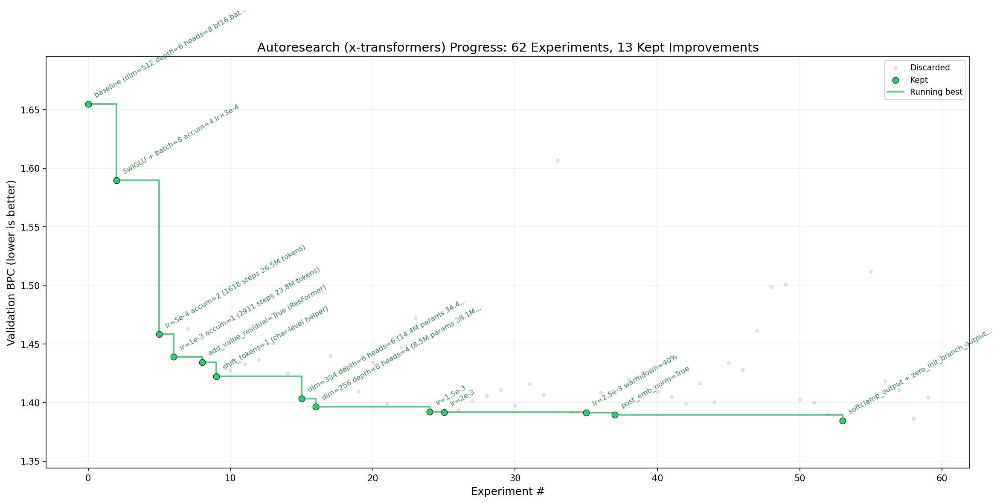
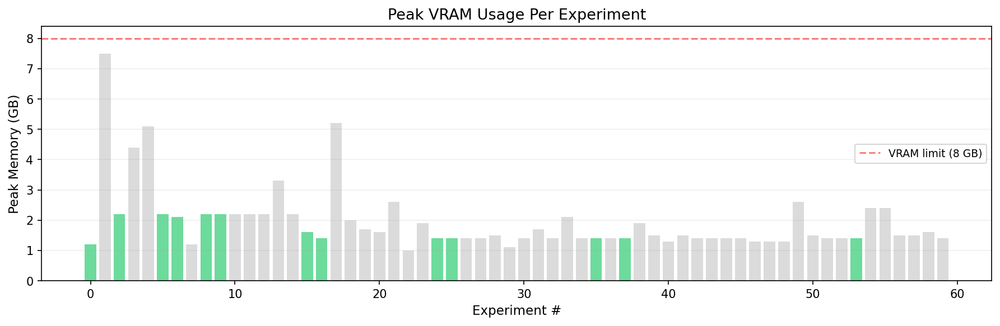

Autonomous LLM-driven research on character-level language modeling using my fork of [x-transformers](https://github.com/TimS-ml/x-transformers). Runs on any NVIDIA GPU with under 8 GB VRAM. FP8 training supported on Ada Lovelace / Hopper / Blackwell GPUs.





# autoresearch (x-transformers edition)

*One day, frontier AI research used to be done by meat computers in between eating, sleeping, having other fun, and synchronizing once in a while using sound wave interconnect in the ritual of "group meeting". That era is long gone. Research is now entirely the domain of autonomous swarms of AI agents running across compute cluster megastructures in the skies. The agents claim that we are now in the 10,205th generation of the code base, in any case no one could tell if that's right or wrong as the "code" is now a self-modifying binary that has grown beyond human comprehension. This repo is the story of how it all began. -@karpathy, March 2026*.

The idea: give an AI agent a small but real LLM training setup and let it experiment autonomously overnight. It modifies the code, trains for 5 minutes, checks if the result improved, keeps or discards, and repeats. You wake up in the morning to a log of experiments and (hopefully) a better model. This edition uses Phil Wang's [x-transformers](https://github.com/lucidrains/x-transformers) library, which provides a rich set of transformer architectural features to explore. The core idea is the same as [Karpathy's autoresearch](https://github.com/karpathy/autoresearch) — you program the `program.md` Markdown file that provides context to the AI agent.

## How it works

The repo has a few key files:

- **`train.py`** — the single file the agent edits. Contains the x-transformers model (TransformerWrapper + Decoder + AutoregressiveWrapper), optimizer (MuonAdamAtan2), and training loop. Everything is fair game: architecture, hyperparameters, optimizer, batch size, etc. **This file is edited and iterated on by the agent**.
- **`program.md`** — instructions for the agent. Point your agent here and let it go. **This file is edited and iterated on by the human**.
- **`AGENTS.md`** — detailed experiment protocol including hardware specs, x-transformers parameter space guide, model sizing rules, and experiment ideas.
- **`docs/adjustable_params.md`** — comprehensive reference of all adjustable x-transformers parameters with descriptions and paper links.
- **`x-transformers/`** — the x-transformers library (git submodule, read-only reference).

Dataset: **enwik8** (character-level, 256 vocab, 90M train / 5M val). Metric: **val_bpc** (validation bits per character) — lower is better.

By design, training runs for a **fixed 5-minute time budget** (wall clock, excluding startup/compilation), regardless of your hardware. This makes experiments directly comparable.

## Quick start

**Requirements:** A single NVIDIA GPU (>= 8 GB VRAM), Python 3.10+, [uv](https://docs.astral.sh/uv/).

```bash
# 1. Install uv project manager (if you don't already have it)
curl -LsSf https://astral.sh/uv/install.sh | sh

# 2. Clone and set up my fork of x-transformers with fp8 support
git clone https://github.com/TimS-ml/x-transformers
uv sync

# 3. Verify data exists
ls x-transformers/data/enwik8.gz

# 4. Verify imports work
uv run python -c "from x_transformers import TransformerWrapper; print('OK')"

# 5. Run a single training experiment (~5 min)
uv run train.py
```

If the above commands all work ok, your setup is working and you can go into autonomous research mode.

### Optional: FP8 training

FP8 requires an **Ada Lovelace / Hopper / Blackwell** GPU (RTX 40xx, A100, H100, etc.) and NVIDIA's [Transformer Engine](https://github.com/NVIDIA/TransformerEngine). TE compiles C++/CUDA extensions against cuDNN headers, which are bundled with conda/mamba but **not** with pip-only installs. We recommend using [miniconda](https://www.anaconda.com/docs/getting-started/miniconda/install) or [micromamba](https://mamba.readthedocs.io/en/latest/installation/micromamba-installation.html) for FP8:

```bash
# Create a conda/mamba env with CUDA toolkit + cuDNN
conda create -n torch python=3.10 pytorch pytorch-cuda=12.8 -c pytorch -c nvidia
conda activate torch

# Install Transformer Engine (needs cuDNN headers from conda)
pip install --no-build-isolation transformer_engine[pytorch]

# Install project deps and run with FP8
pip install -e .
USE_FP8=1 python train.py
```

If you don't have a compatible GPU, just skip this — BF16 (the default) works on any NVIDIA GPU.

## Running the agent

Spin up your Claude/Codex or whatever you want in this repo, then prompt:

```
Hi have a look at program.md and let's kick off a new experiment!
```

The `program.md` file is the "skill" that drives the autonomous agent. `AGENTS.md` provides the full protocol.

## Project structure

```
train.py                — model, optimizer, training loop (agent modifies this)
program.md              — agent instructions
analysis.ipynb          — generated notebook from analysis.py
docs/
  adjustable_params.md  — x-transformers parameter reference
x-transformers/         — x-transformers library (git submodule, read-only)
```

## Design choices

- **x-transformers as the model backbone.** Phil Wang's library provides 50+ architectural options (GLU, RoPE, GQA, macaron, sandwich norm, etc.) — a huge search space for the agent to explore. The agent only touches `train.py` to configure these options.
- **Character-level enwik8.** No tokenizer needed. 256-vocab byte-level, so BPC (bits per character) is the natural metric. Simple and fast.
- **Fixed time budget.** Training always runs for exactly 5 minutes. This makes experiments directly comparable regardless of what the agent changes. ~12 experiments/hour, ~100 overnight.
- **Self-contained.** One GPU, one file, one metric. The x-transformers submodule provides the model; everything else is standard PyTorch.

## Credits

- [Karpathy's autoresearch](https://github.com/karpathy/autoresearch) — the original concept
- [Phil Wang's x-transformers](https://github.com/lucidrains/x-transformers) here is [my fork](https://github.com/TimS-ml/x-transformers) — the model library

## License

MIT
